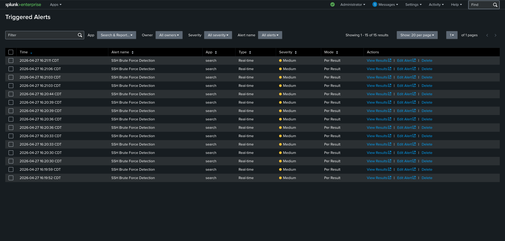
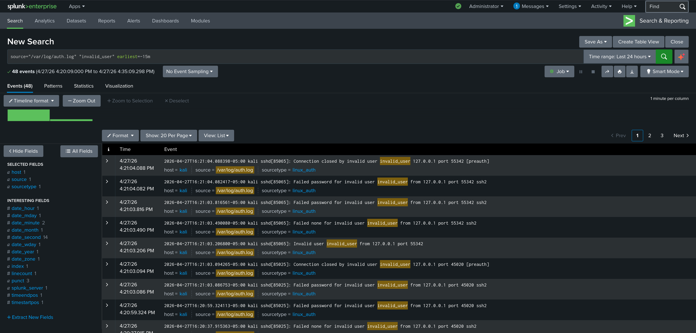

# Lab 24 — Splunk Attack Simulation & Alerting

## Executive Summary

This lab documents a live SSH brute force attack simulation against Kali Linux with real-time detection and alerting validation in Splunk Enterprise. Ten consecutive failed SSH authentication attempts were generated using a scripted loop targeting an invalid user account. The SSH Brute Force Detection rule created in Lab 23 fired 15 real-time alerts, confirming end-to-end detection capability from attack execution through SIEM alerting.

---

## Incident Ticket (ServiceNow Simulation)

| Field | Details |
|---|---|
| **Incident ID** | INC-0024 |
| **Date/Time Detected** | April 27, 2026 @ 16:19 CDT |
| **Detected By** | Splunk — SSH Brute Force Detection rule |
| **Severity** | Medium |
| **Category** | Security Event |
| **Subcategory** | Brute Force / Authentication Attack |
| **Short Description** | SSH brute force attack detected and alerted by Splunk |
| **Detailed Description** | A scripted SSH brute force attack was executed from localhost against invalid_user@127.0.0.1. 10 consecutive connection attempts were made, each generating multiple failed authentication events. The Splunk real-time detection rule fired 15 alerts within seconds of the attack. 48 SSH brute force events were confirmed in the Splunk index. |
| **IOCs** | invalid_user@127.0.0.1, repeated sshd failed password and invalid user events |
| **Analysis** | Attack originated from localhost (127.0.0.1). All connection attempts targeted a non-existent user account. Each attempt generated Invalid user, Failed none, and Failed password events in auth.log, all ingested and detected by Splunk in real time. |
| **Impact Assessment** | No system compromise. Simulated attack for detection validation purposes. Detection rule confirmed functional. |
| **Response Actions Taken** | Attack simulation executed, Splunk triggered alerts reviewed, event search confirmed 48 matching events in index. |
| **Recommended Actions** | In a production environment, block source IP after threshold exceeded, notify SOC tier 2, and initiate incident response workflow. |
| **Status** | Closed |

---

## Lab Objectives

- Execute a controlled SSH brute force simulation against Kali Linux
- Confirm Splunk real-time detection rule fires on live attack traffic
- Validate alert count and event correlation in Splunk
- Document end-to-end detection from attack to alert

---

## Environment Overview

| Component | Details |
|---|---|
| Host OS | Windows |
| VM | Kali Linux (VMware Workstation) |
| Splunk Version | Enterprise 10.2.2 |
| Splunk URL | http://localhost:8000 |
| Log Source | /var/log/auth.log |
| Source Type | linux_auth |
| Attack Target | invalid_user@127.0.0.1 |

---

## Attack Simulation

### Command Executed

```bash
for i in {1..10}; do ssh -o ConnectTimeout=5 invalid_user@127.0.0.1; done
```

### What This Does

- Initiates 10 consecutive SSH connections to localhost
- Each connection targets a non-existent user account
- Empty password entries submitted at each prompt
- Each connection generates: Invalid user, Failed none, Failed password, Connection closed events in auth.log

---

## Detection Results

### Triggered Alerts

- Alert name: SSH Brute Force Detection
- Alerts fired: **15**
- Type: Real-time
- Severity: Medium
- Mode: Per Result
- Time range: 16:19 — 16:21 CDT

### Event Search Validation

SPL query run post-simulation:

```spl
source="/var/log/auth.log" "invalid_user" earliest=-15m
```

- Events returned: **48**
- Time range: 4/27/26 4:20:09 PM — 4/27/26 4:35:09 PM
- All events confirmed as SSH brute force activity from simulation

---

## Evidence

| File | Description |
|---|---|
| `splunk-triggered-alerts.png` | Splunk Triggered Alerts showing 15 SSH Brute Force Detection alerts |
| `splunk-attack-search.png` | Splunk search showing 48 invalid_user events from simulation |




---

## Detection Engineering Insights

- Real-time Per-Result alerting generates one alert per matching log event — appropriate for high-fidelity brute force detection
- 10 SSH connections generated 48 events due to multiple log lines per connection (Invalid user, Failed none, Failed password x2, Connection closed)
- The detection pipeline — attack → auth.log → rsyslog → Splunk ingestion → real-time alert — completed in under 2 seconds per event
- This mirrors the detection validated in Elastic SIEM (Lab 21), demonstrating platform-agnostic SOC capability

---

## Conclusions

End-to-end SSH brute force detection is confirmed in Splunk. The attack simulation generated 48 events, triggered 15 real-time alerts, and validated the full detection pipeline from attack execution through SIEM alerting. The Splunk environment is now ready for threat hunting in Lab 25.

---

## Next Steps

- Lab 25 — Threat Hunting in Splunk
